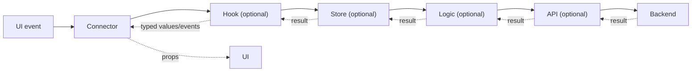
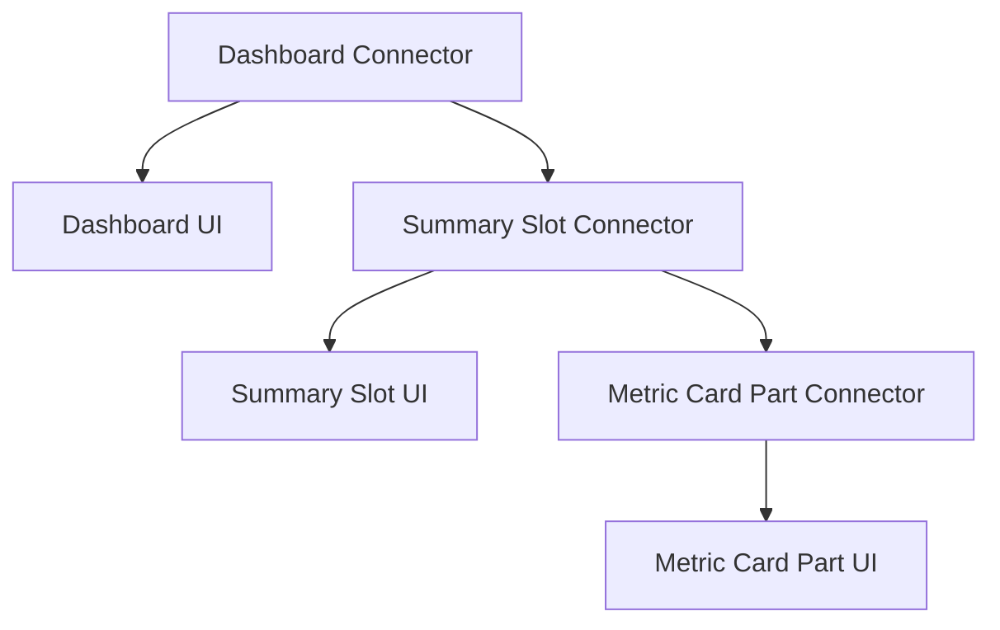
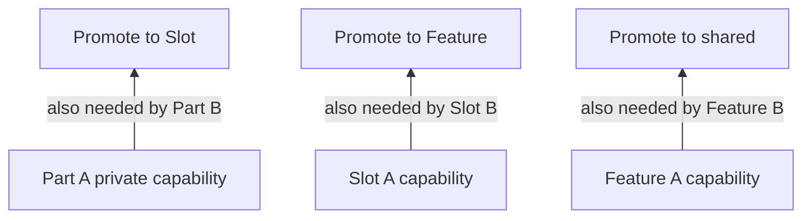

# Srijika Feature → Slot → Part → Shared Architecture

Srijika uses one progressive behavior chain for every visual behavior owner:

```text
UI ← Connector → Hook → Store → Logic → API → Backend
```

`UI` and `Connector` are required for every Feature, Slot, Part, and Shared
Widget. `Hook`, `Store`, `Logic`, `API`, and `Types` are optional capabilities.
Shared UI Primitives and Shared Headless Capabilities intentionally use the
stricter exceptions described below. An owner creates only the capabilities it
needs, but it must never jump over a more senior capability that already exists
for the same behavior.

This contract applies equally to code created in Studio, VS Code, a generated
project, or by Codex through the Srijika plugin. The resolved `{sharedRoot}` uses the same
capability language through three strict shared owner kinds described below;
it is never a freehand utility directory.

Literal paths and filenames in the example trees use the canonical defaults.
Every tool first resolves the project's configured roots, structural directory
names, and suffixes; placeholders such as `{sharedRoot}` and `{uiSuffix}` below
refer to those resolved values.

## Governing rules

1. A matching Connector is the only runtime caller of a UI.
2. A Connector calls the highest available behavior capability in its owner.
3. Every capability calls the next available capability below it.
4. An existing intermediate capability may not be skipped.
5. Results return through the same chain and become typed UI props.
6. Private code moves to a common owner instead of being imported sideways.
7. Empty pass-through capabilities are not generated merely to complete the
   diagram.

The complete command and result path is:



## Canonical Dashboard structure

Every Feature, Slot, and Part repeats the same file contract. A created Slot or
Part immediately receives its required UI and Connector; optional capability
files are added only when selected or recommended.

### Strict ownership-aware creation

Studio folder `+`, Studio folder right-click, the VS Code Explorer command, and
Codex all use one creation matrix:

```text
src/features -> New Feature
Feature root  -> Connector | Hook | Private Hook | Store | Private Store | Logic | API | Types | New Slot
Slot root     -> Connector | Hook | Private Hook | Store | Private Store | Logic | API | Types | New Part
Part root     -> Connector | Hook | Private Hook | Store | Private Store | Logic | API | Types
src/shared    -> Shared UI Primitive | Shared Widget | Shared Headless Capability
```

A new Feature, Slot, or Part is a composite scaffold. The entered normalized
PascalCase name derives its kebab-case folder and every related file name. UI
and Connector are required; Hook, Store, Logic, API, and Types are selectable.
All target paths are checked before writing, existing files are never
overwritten, and noncanonical folders or alternate file names are rejected.

```text
src/
├─ features/
│  └─ dashboard/
│     ├─ Dashboard.ui.tsx                    required
│     ├─ Dashboard.connector.tsx             required
│     ├─ useDashboard.ts                     flat Hook gateway (small owner)
│     ├─ hooks/                              expanded Hook mode (alternative)
│     │  ├─ useDashboard.ts                  only public Hook gateway
│     │  ├─ useDashboardFilters.ts           private behavior
│     │  └─ useDashboardSelection.ts         private behavior
│     ├─ dashboard.store.ts                  flat Store gateway (small owner)
│     ├─ stores/                             expanded Store mode (alternative)
│     │  ├─ dashboard.store.ts               only public Store gateway
│     │  ├─ dashboardFilters.store.ts        private concern
│     │  └─ dashboardSelection.store.ts      private concern
│     ├─ dashboard.logic.ts                  optional Logic
│     ├─ dashboard.api.ts                    optional API
│     ├─ dashboard.types.ts                  optional shared owner types
│     └─ slots/
│        ├─ summary/
│        │  ├─ Summary.ui.tsx                required
│        │  ├─ Summary.connector.tsx         required
│        │  ├─ useSummary.ts                 optional Hook
│        │  ├─ summary.store.ts              optional Store
│        │  ├─ summary.logic.ts              optional Logic
│        │  ├─ summary.api.ts                optional API
│        │  ├─ summary.types.ts              optional owner types
│        │  └─ parts/
│        │     ├─ metric-card/
│        │     │  ├─ MetricCard.ui.tsx       required
│        │     │  ├─ MetricCard.connector.tsx required
│        │     │  ├─ useMetricCard.ts        optional Hook
│        │     │  ├─ metricCard.store.ts     optional Store
│        │     │  ├─ metricCard.logic.ts     optional Logic
│        │     │  ├─ metricCard.api.ts       optional API
│        │     │  └─ metricCard.types.ts     optional owner types
│        │     └─ progress-chart/
│        │        ├─ ProgressChart.ui.tsx
│        │        └─ ProgressChart.connector.tsx
│        └─ recent-orders/
│           ├─ RecentOrders.ui.tsx
│           ├─ RecentOrders.connector.tsx
│           ├─ useRecentOrders.ts
│           ├─ recentOrders.store.ts
│           ├─ recentOrders.logic.ts
│           ├─ recentOrders.api.ts
│           ├─ recentOrders.types.ts
│           └─ parts/
│              └─ order-row/
│                 ├─ OrderRow.ui.tsx
│                 └─ OrderRow.connector.tsx
└─ shared/                                  cross-feature public owners only
   ├─ ui/
   │  └─ button/
   │     ├─ Button.ui.tsx                  required pure UI boundary
   │     └─ button.types.ts                optional type-only contract
   ├─ widgets/
   │  └─ user-menu/
   │     ├─ UserMenu.ui.tsx                required
   │     ├─ UserMenu.connector.tsx         required public runtime boundary
   │     ├─ useUserMenu.ts                 optional Hook
   │     ├─ userMenu.store.ts              optional Store
   │     ├─ userMenu.logic.ts              optional Logic
   │     ├─ userMenu.api.ts                optional API
   │     └─ userMenu.types.ts              optional Types
   └─ capabilities/
      └─ auth/
         ├─ useAuth.ts                     optional Hook/public gateway
         ├─ auth.store.ts                  optional Store/public gateway fallback
         ├─ auth.logic.ts                  optional Logic/public gateway fallback
         ├─ auth.api.ts                    optional API/public gateway fallback
         └─ auth.types.ts                  optional Types; runtime layer required
```

## Machine-owned test contract

The framework-neutral architecture engine emits
`srijika-test-contract-v1` for the same owner tree. This is the source of truth
for automatic test generation; an AI caller does not decide that a Part is too
small to test or invent its own affected-file list.

Each discovered Feature, Slot, Part, Shared UI Primitive, Shared Widget, and
Shared Headless Capability records:

- its stable owner ID, canonical path, files, and capabilities;
- required architecture and TypeScript checks;
- Node unit coverage for Store, Logic, and API behavior;
- framework-adapter component coverage for UI, Connector, and Hook composition;
- browser, fixed-viewport visual, and accessibility evidence for every owner
  with a canonical UI, including every Part;
- runtime and type-only file dependency edges.

The dependency graph includes governed owners and project-local support files.
Given changed files, the engine walks reverse imports transitively and returns
the exact affected owners and requirement IDs. A shared style or type change
therefore selects every consuming Slot and Feature, while an unrelated Part is
not rerun. Vite and Next.js adapters consume the same requirements and differ
only in how they create the DOM or real-runtime harness.

The Vite adapter currently generates a deterministic `tests/srijika/` plan:

```text
tests/srijika/
├─ contract.generated.json
├─ owner-fixtures.ts                    preserved, never overwritten by sync
├─ harness/index.html
├─ harness/main.tsx
├─ vitest.config.ts
├─ playwright.config.ts
└─ owners/
   ├─ feature--dashboard.component.test.tsx
   ├─ feature--dashboard.spec.ts
   ├─ part--dashboard--summary--metric-card.component.test.tsx
   └─ part--dashboard--summary--metric-card.spec.ts
```

Every visual owner receives a server-rendered component smoke plus isolated
Playwright behavior, visual, and Axe cases. Store, Logic, and API owners receive
a Vitest runtime surface. The plan also declares exact test dependencies and
scripts. Any requirement the first adapter cannot honestly satisfy—for example
a headless Hook needing providers—is returned in
`uncoveredRequirementIds`; tooling must not report the owner green until a
fixture/provider adapter covers it.

The Next App Router adapter keeps the same owner contract but uses the real
framework runtime. It generates an isolated `tests/srijika-next/` App Router
harness, Vitest only for framework-neutral Store/Logic/API modules, and
Playwright render, visual, and Axe evidence for every visual owner. Async Server
Components are never downgraded into a fake jsdom component test.

Production routes remain a thin adapter layer:

```text
src/app/products/[productId]/page.tsx  → ProductConnector
src/features/product/                  → owned UI and behavior
```

The route planner classifies each public Connector as `server`, `client`, or
`invalid`. Hooks and browser APIs require a `'use client'` directive at the
Connector. A client Connector may not absorb an async or `server-only` owner;
server loading stays in a Server Component and passes serializable props across
the boundary. Route synchronization fails closed while diagnostics remain,
preserves an authored root layout, and updates only files carrying Srijika's
generated-route marker. Srijika Slots are ownership concepts and are never
silently translated into Next.js `@parallel-route` folders.

## Capability responsibilities

| Capability | Responsibility                                                                                       | May know                                                  |
| ---------- | ---------------------------------------------------------------------------------------------------- | --------------------------------------------------------- |
| UI         | Typed visual JSX, data props, event props, and `ReactNode` composition slots                         | UI-safe types and components                              |
| Connector  | The owner's public runtime gateway; maps capability output to UI props and composes child Connectors | Matching UI and the highest available behavior capability |
| Hook       | React lifecycle, optional TanStack Query, effects, subscriptions, cache, retry, and mutations        | The next available Store, Logic, or API                   |
| Store      | Shared client state, selectors, synchronous transitions, and owner actions                           | The next available Logic or API                           |
| Logic      | Business rules, validation, authorization decisions, transformations, and operation orchestration    | The matching API and pure types/utilities                 |
| API        | URL, HTTP method, headers, request/response parsing, and transport errors                            | Shared HTTP client and API types                          |
| Types      | Contracts shared by two or more files in the same owner                                              | Other type-only modules                                   |

`Types` is not a runtime step. A file ending in the resolved Types suffix
(canonical default `.types.ts`) contains only interfaces,
type aliases, `import type`, `export type`, and an optional empty `export {}`.
It cannot declare/export a runtime value or refer to one through `typeof`, a
computed property, or another value expression. Every consumer uses
`import type`/`export type`. Runtime constants and functions belong in Hook,
Store, Logic, or API.

## Strict UI boundary

Every file ending in the resolved UI suffix (canonical default `.ui.tsx`) is
behavior-free, including Feature, Slot, Part, Shared Widget, and Shared UI
renderers. It may render JSX, read typed props, invoke an
event callback supplied by props, and compose a `ReactNode` supplied by props.
It may not:

- call an identifier Hook such as `useHome()` or a property-access Hook such as
  `React.useState()`;
- access browser/runtime APIs, including timers, observers, workers, storage,
  DOM/navigation globals, media/file parsers, `fetch`, `XMLHttpRequest`,
  `WebSocket`, `window`, `globalThis`, `self`, `process`, `Deno`, or `Bun`;
- import or execute external runtime behavior, including state, router, request,
  query-lifecycle, or callable utility modules;
- import Connector, Hook, Store, Logic, or API code; or
- own request, state, effect, routing, mutation, or business behavior.

External imports in UI are limited to type-only contracts, styles/assets, safe
React JSX support, and presentational bindings used exclusively as JSX tags.
Importing a component does not permit calling its runtime helpers inside UI.
The exact presentational asset allowlist is CSS-family styles plus
`svg/png/jpeg/gif/webp/avif/ico`, `woff/woff2/ttf/otf/eot`,
`mp3/wav/ogg`, and `mp4/webm`, with an optional query or fragment. Any other
external value import must be proven JSX-only; callable utility use is runtime
behavior and is rejected.

Only the owner's matching Connector imports and renders that owner's UI. A
parent or sibling composes a child through the file ending in the resolved
Connector suffix, never by importing the child file ending in the resolved UI
suffix. The single cross-owner exception is pure UI composition of a canonical
`{sharedRoot}/ui/<owner>/Owner{uiSuffix}` primitive.

These hard boundaries have stable numeric and semantic identifiers:

```text
SRIJIKA4101  SRIJIKA-ARCH-UI-RUNTIME-IMPORT
SRIJIKA4116  SRIJIKA-ARCH-DIRECT-CHILD-UI
SRIJIKA4117  SRIJIKA-ARCH-PASSIVE-TYPES
SRIJIKA4118  SRIJIKA-ARCH-LOGIC-RUNTIME-CONCERN
SRIJIKA4119  SRIJIKA-ARCH-UNPROVABLE-DYNAMIC-IMPORT
SRIJIKA4120  SRIJIKA-ARCH-UNRESOLVED-PROJECT-ALIAS
SRIJIKA4121  SRIJIKA-ARCH-UNRESOLVED-PROJECT-IMPORT
```

Inside a configured Feature or Shared ownership root—and in the authoritative
configured UI `entry` even when it sits outside those roots—every `import()`
and CommonJS `require()` target must be a static string literal or a
no-substitution template literal. A computed module target cannot be proven
against the ownership graph and fails with `SRIJIKA4119`. Project-local aliases
must resolve through the project TypeScript configuration to a scanned governed
source; otherwise they fail closed with `SRIJIKA4120`.
Every relative or `src/...` source import made by a governed file must likewise
resolve to a scanned source inside the configured Feature or Shared roots;
missing or outside-root targets fail with `SRIJIKA4121`. CSS and static-asset
imports are exempt, and external packages use ordinary bare package specifiers.

## Strict Logic boundary

`*.logic.ts` is framework-free and deterministic. Logic may own business rules,
pure validation and authorization decisions, deterministic transforms,
aggregation, and multi-step orchestration through its matching API boundary. It
may consume passive Types and pure utility libraries such as a schema validator.

Logic may not own React or Hook lifecycle, React Query/query-cache lifecycle,
router lifecycle/navigation state, client-state library lifecycle, browser
globals, or request transport. This includes `fetch.call(...)`, identifier or
constructor references to `fetch`, `XMLHttpRequest`, `WebSocket`, `EventSource`,
or `Request`, and request packages such as `node:http`, `node:https`, `http`,
`https`, `undici`, `cross-fetch`, `node-fetch`, and `ofetch`. Move
React and query behavior to the owner Hook, shared client state to Store,
routing to Connector, and request transport to API. Hook-like calls,
query-client lifecycle calls/constructors, and imports from those framework
families fail with `SRIJIKA4118` /
`SRIJIKA-ARCH-LOGIC-RUNTIME-CONCERN`. This boundary does not remove pure
validation or transformation from Logic.

## Highest-available resolution

The runtime resolver is deterministic:

```text
Connector: Hook, otherwise Store, otherwise Logic, otherwise API
Hook:      Store, otherwise Logic, otherwise API
Store:     Logic, otherwise API
Logic:     API
API:       shared HTTP client / Backend
```

Therefore all of these configurations are valid:

```text
Connector
Connector → API
Connector → Logic → API
Connector → Store → Logic → API
Connector → Hook → Store → Logic → API
Connector → Hook → Logic → API
Connector → Hook → API
Connector → Store → API
```

If `Hook` exists, the Connector may not import Store, Logic, or API for that
behavior. If `Store` exists below Hook, Hook may not jump to Logic or API. If
`Logic` exists below Store, Store may not jump to API.

### Behavior-level resolution

Seniority is checked per owner and public behavior, not merely by filename. A
capability must expose the behavior before it becomes that behavior's gateway.
The validator must not silently treat a direct lower-layer import as a valid
fallback when a senior file exists. It should recommend adding the behavior to
the senior capability, or explicitly declaring that behavior as not owned by
it.

Example:

```text
loadDashboard:    Connector → Hook → Store → Logic → API
selectLocalTab:   Connector → Hook → Store
formatStaticDate: Connector → Logic
```

This keeps one clear path without forcing unrelated work through meaningless
pass-through functions.

## Feature, Slot, and Part composition

The behavior chain is private to each owner. Composition crosses an ownership
boundary only through Connectors and typed props.



A Feature Connector composes Slot Connectors into its UI's named `ReactNode`
slots. A Slot Connector composes Part Connectors in the same way. A parent must
not render a child file ending in the resolved UI suffix directly or import the child's private Hook,
Store, Logic, or API.

## Ownership and promotion

Each capability belongs to the narrowest owner that needs it:

```text
one Part needs it       → Part root
two Parts need it       → their Slot root
two Slots need it       → their Feature root
two Features need it    → src/shared
```



Allowed visibility flows from an ancestor owner to its descendants. Private
child code never flows upward, sideways to a sibling, or into another Feature.

```text
ancestor public capability  ──✓──> descendant
private child capability    ──✗──> parent or sibling
feature-private capability  ──✗──> another feature
```

## Strict shared architecture

`{sharedRoot}` contains exactly three public owner kinds. It is not a place for
arbitrary `utils`, `common`, nested feature copies, or alternate file names.
All shared names are normalized once and derive their folder and file names.

### Shared UI Primitive

Use `{sharedRoot}/ui/<name>/` for visual primitives such as Button, Input, Modal,
Spinner, and typography. `Owner{uiSuffix}` is required and `owner{typesSuffix}` is the
only optional file. A primitive:

- accepts all data, events, and composition through typed props;
- contains no Connector, Hook, Store, Logic, API, request, routing, or business
  behavior;
- never imports a Feature; and
- may be rendered directly by another pure UI because the UI file itself is its
  public boundary.

### Shared Widget

Use `src/shared/widgets/<name>/` for reusable visual behavior such as UserMenu,
NotificationBell, or FileUploader. UI and Connector are required. Hook, Store,
Logic, API, and Types are optional and follow the same highest-available,
no-jump chain as a Feature owner. Multiple Hooks or Stores use the same
mutually-exclusive `hooks/` and `stores/` expansion rules. Consumers compose
only `OwnerConnector`; they do not import the widget UI or private runtime
files.

### Shared Headless Capability

Use `src/shared/capabilities/<name>/` for cross-feature behavior without a
visual surface, such as authentication/session, permissions, analytics, or a
common HTTP client. UI and Connector are forbidden. Hook, Store, Logic, API,
and Types are selectable, but at least one runtime layer (Hook, Store, Logic,
or API) is required; Types alone is not a capability. The first present runtime
layer is the public boundary:

```text
Hook, otherwise Store, otherwise Logic, otherwise API
```

Consumers import only that public boundary. Internal layers still follow
Hook → Store → Logic → API without jumping. Expanded Hook and Store gateways
follow the same one-level folder and owner-derived naming rules.

### Shared dependency direction

Shared code never imports `src/features`. A Feature, Slot, or Part may consume a
public shared boundary visible to it, but never a private shared Hook helper,
Store concern, Logic implementation, or API implementation hidden behind a
more senior shared layer. Shared owners may use other shared owners only through
their public boundaries and must not form a dependency cycle.

Shared boundary failures use stable semantic IDs:

```text
SRIJIKA-ARCH-SHARED-REVERSE-DEPENDENCY
SRIJIKA-ARCH-SHARED-PRIVATE-IMPORT
SRIJIKA-ARCH-SHARED-MISSING-RUNTIME-GATEWAY
```

Examples:

```text
Button               → src/shared/ui/button
User menu            → src/shared/widgets/user-menu
Auth/session          → src/shared/capabilities/auth
Common HTTP transport → src/shared/capabilities/http (API + Types)
```

The same creation choices and validation rules are available from CLI, VS Code,
Studio, and MCP:

```bash
srijika add shared-ui Button --types
srijika add shared-widget UserMenu --hook --store --logic --api --types
srijika add shared-capability Auth --hook --store --logic --api --types
```

All four surfaces preview exact paths, preflight the complete request, refuse
overwrite, and apply one coherent plan. None may create an extra folder or
silently weaken the shared contract.

## Cache and state guidance

### Hook owns server lifecycle

Use the Hook for React lifecycle behavior and, when the project explicitly
enables it, TanStack Query:

- optional server cache, stale time, deduplication, and invalidation;
- loading, failure, retry, refresh, pagination, and mutation lifecycle;
- subscriptions, polling, cancellation, and React effects.

### Store owns client state

Use the Store for state shared inside its owner subtree:

- selected tab, open panels, filters, drafts, and wizard progress;
- selectors and synchronous state transitions;
- actions that continue to the next available Logic or API capability.

When no Hook exists, a Store may execute an owner action and retain its current
result. It is not a server cache. Once the behavior requires staleness,
deduplication, retry, background refresh, or mutation invalidation, add a Hook.
Use TanStack Query only when the project opted in with
`srijika create ... --react-query`; the default starter has no TanStack
dependency or Provider. Do not mirror the same server entity in both Query
cache and Zustand.

## Enforcement levels

### Errors

These are deterministic architecture violations and must block validation:

- a UI imports or calls Hook, Store, Logic, or API;
- a UI is rendered by anything except its matching Connector;
- a required UI or Connector is missing;
- a runtime layer skips an available intermediate layer for the same behavior;
- Logic contains React, React Query/query-cache, router, or client-state
  lifecycle concerns;
- API contains business decisions or imports a senior runtime layer;
- a parent or sibling imports private child code;
- Feature-private code is imported by another Feature;
- a parent composes a child UI instead of the child Connector;
- a UI calls any Hook (including `React.useState`) or accesses a browser/runtime
  API such as `fetch`, `XMLHttpRequest`, `WebSocket`, `localStorage`, or
  `sessionStorage`;
- a Types module declares/exports a runtime value, references a runtime value,
  or is consumed without `import type`/`export type`;
- a computed `import()` or `require()` target appears inside a configured
  Feature or Shared ownership root;
- a declared or reserved project alias does not resolve to a scanned source
  inside the configured ownership roots;
- a governed relative or `src/...` source import is missing, outside the
  configured ownership roots, or absent from the complete bounded scan;
- shared code imports a Feature or a consumer imports a private shared layer;
- a Shared UI Primitive contains a runtime layer;
- a Shared Widget is missing UI or Connector;
- a Shared Headless Capability contains UI/Connector or has no runtime layer;
- a noncanonical folder or file exists beneath `src/shared`;
- a runtime dependency cycle exists between Shared owners. Type-only edges do
  not form runtime cycles.

### Intelligent recommendations

Recommendations are deterministic and non-blocking in the first architecture
release. They explain why a capability should be introduced and offer a safe
refactor path.

| Recommendation       | Trigger signals                                                                                                                                                                      |
| -------------------- | ------------------------------------------------------------------------------------------------------------------------------------------------------------------------------------ |
| Add Logic            | Direct API use contains two or more endpoint calls, business branching, validation, authorization, payload transformation, aggregation, or multi-step orchestration                  |
| Add Hook             | Connector/Store behavior needs cache, retry, polling, cancellation, subscription, pagination, mutation lifecycle, two or more async handlers, or three or more React lifecycle hooks |
| Add Store            | State is consumed by two or more descendants, props cross two ownership boundaries, or an owner Connector contains four or more related local state fields                           |
| Add Hook above Store | A Connector consumes five or more Store selectors/actions, or Store actions accumulate async lifecycle/cache responsibilities                                                        |
| Promote owner        | A private Hook, Store, Logic, or API is consumed across an owner boundary, proving two consumers and requiring their nearest common owner                                            |
| Split owner          | A UI exceeds 200 meaningful exported-function lines, its resolved-UI-suffix source exceeds 300 meaningful lines, or its public contract exceeds 16 top-level members                 |

These are per-UI maintainability guardrails, not an application-size limit.
An application may contain any number of Features, Slots, Parts, and strict
Shared owners; a growing UI is split or promoted without flattening ownership.

These are the stable deterministic v1 recommendation IDs:

```text
SRIJIKA-ARCH-RECOMMEND-LOGIC
SRIJIKA-ARCH-RECOMMEND-HOOK
SRIJIKA-ARCH-RECOMMEND-STORE
SRIJIKA-ARCH-RECOMMEND-HOOK-ABOVE-STORE
SRIJIKA-ARCH-RECOMMEND-PROMOTE-OWNER
SRIJIKA-ARCH-RECOMMEND-SPLIT-OWNER
```

Both recommendations are emitted, not merely documented. `PROMOTE-OWNER` is
returned with `owner-consumers = 2` evidence and attached to the blocking
private-ownership diagnostic that exposed the sideways dependency.
`SPLIT-OWNER` is returned and emitted as the non-blocking `SRIJIKA4202` warning
only when a limit is strictly exceeded: 201 function lines, 301 file lines, or
17 contract members. Values 200, 300, and 16 remain valid.

A single transport-only request may remain `Connector → API`. A small pure
business operation may remain `Connector → Logic → API`. When two or more Hook
signals are present, Srijika should elevate the guidance from an informational
suggestion to a warning. Structural no-jump and ownership rules remain errors
regardless of complexity.

Example recommendation:

```text
SRIJIKA-ARCH-RECOMMEND-HOOK

Dashboard Connector owns 3 async handlers and 4 request lifecycle fields.
Recommended path:
DashboardConnector → useDashboard → dashboard.store → dashboard.logic → dashboard.api
```

Example error:

```text
SRIJIKA-ARCH-LAYER-JUMP

DashboardConnector imports dashboard.api.ts, but useDashboard.ts is the
highest available owner capability for loadDashboard.

Required path:
DashboardConnector → useDashboard → dashboard.store → dashboard.logic → dashboard.api
```

## Naming

- owner component names use `PascalCase`;
- folders use stable `kebab-case`;
- UI files end in the resolved UI suffix (canonical default `.ui.tsx`);
- Connector files end in the resolved Connector suffix (canonical default `.connector.tsx`);
- Hooks begin with `use` and end in `.ts` or `.tsx`;
- Stores end in the resolved Store suffix (canonical default `.store.ts`);
- Logic files end in the resolved Logic suffix (canonical default `.logic.ts`);
- API files end in the resolved API suffix (canonical default `.api.ts`);
- owner contracts end in the resolved Types suffix (canonical default `.types.ts`).
- shared owner roots are only `{sharedRoot}/ui`, `{sharedRoot}/widgets`, and
  `{sharedRoot}/capabilities`.

Feature, Slot, Part, and Shared owner folders must use the exact derived
`kebab-case` spelling. Alternate case, underscores, aliases, freehand
`src/shared` root files, `utils`, `common`, barrels, and deeper arbitrary folders
do not become new public boundaries and fail validation.

Hook and Store each have exactly two mutually exclusive layouts. A small owner
uses flat `useOwner.ts` and `owner.store.ts`. Adding a second behavior/concern
atomically switches that capability to expanded mode: the public gateway moves
to `hooks/useOwner.ts` or `stores/owner.store.ts`, imports are rewired, and the
new owner-prefixed private file is created beside it. The old root gateway must
not remain.

That migration searches the full project source tree, not only the Feature and
Shared roots, so application-shell and tooling imports are not left pointing at
the removed flat gateway. It considers TS, TSX, MTS, CTS, JS, JSX, MJS, and CJS
source, excludes declaration files and generated/vendor directories, and stops
at nested Srijika project boundaries. The scan is symlink-safe and fail-closed:
any unsafe entry, truncation, or read-budget failure is detected before a
directory, moved gateway, helper, or rewritten import is committed.

Only the expanded gateway is public. Connectors never import a private Hook;
Hooks, Connectors, children, and siblings never import a private Store concern.
The only allowed private names are `useOwner<Behavior>.ts` and
`owner<Concern>.store.ts`. These folders stay one level deep; `index.ts`, mixed
flat/folder gateways, arbitrary utilities, alternate names, and deeper folders
are hard architecture errors.

These failures use stable semantic IDs:

```text
SRIJIKA-ARCH-STRICT-OWNER-SHAPE
SRIJIKA-ARCH-MIXED-CAPABILITY-LAYOUT
SRIJIKA-ARCH-MISSING-CAPABILITY-GATEWAY
SRIJIKA-ARCH-SHARED-REVERSE-DEPENDENCY
SRIJIKA-ARCH-SHARED-PRIVATE-IMPORT
SRIJIKA-ARCH-SHARED-MISSING-RUNTIME-GATEWAY
```

## Safe custom architecture configuration

Projects may override the ownership roots, the four structural directory
names, and the six canonical file suffixes inside the `architecture` object in
`srijika.config.json`:

```json
{
  "sourceOfTruth": "tsx",
  "entry": "src/features/home/Home.ui.tsx",
  "architecture": {
    "profile": "feature-slot-part-v1",
    "featuresRoot": "src/features",
    "sharedRoot": "src/shared",
    "slotsDirectory": "slots",
    "partsDirectory": "parts",
    "hooksDirectory": "hooks",
    "storesDirectory": "stores",
    "uiSuffix": ".ui.tsx",
    "connectorSuffix": ".connector.tsx",
    "storeSuffix": ".store.ts",
    "logicSuffix": ".logic.ts",
    "apiSuffix": ".api.ts",
    "typesSuffix": ".types.ts"
  }
}
```

`sourceOfTruth` and `entry` are required even though the `architecture` block
is optional. `sourceOfTruth` must be exactly `"tsx"`. `entry` must be a
normalized project-relative path with at most 32 segments and must end with the
resolved `uiSuffix`. The architecture surface has exactly twelve optional
override fields—two roots, four structural directories, and six suffixes—plus
the required `profile` discriminator whenever that block is present. Omitted
override fields retain their canonical defaults.

The block is optional, but its meaning is fail-closed:

- when `architecture` is absent, every surface uses the canonical defaults;
- when `architecture` is present, it must be an object and must declare
  `"profile": "feature-slot-part-v1"` exactly; and
- a missing or unsupported profile rejects project inspection/validation on
  the generated validator, CLI, VS Code, Studio, and MCP. No surface silently
  falls back after an explicit but invalid architecture declaration.

Customization changes the canonical names; it does not weaken containment:

- roots are normalized project-relative paths with at most 10 segments;
- Feature and Shared roots are separate and non-overlapping;
- slot/part/hook/store directory names are distinct single segments;
- suffixes are case-insensitively distinct, basename-only values;
  UI/Connector end in `.tsx`, the remaining suffixes end in `.ts`, declaration
  suffixes such as `.d.ts`/`.d.tsx` are forbidden, and no suffix may itself end
  with another configured suffix (for example `.ui.tsx` cannot coexist with
  `.tsx`);
- absolute paths, backslashes, empty/`.`/`..` segments, NUL bytes, traversal,
  and root overlap are rejected before discovery or planning; and
- filesystem readers and writers reject symlinked project/config/source roots
  and symlinked scope ancestors, so a configured path cannot escape the project.

Project reads are bounded and fail closed. The configured `entry` is always
included in validation and in the 4,096-source count, even when it is outside
the ownership roots; it remains an authoritative pure UI source and receives
the `SRIJIKA4119`–`SRIJIKA4121` import checks. `srijika.config.json` is limited to
64 KiB and root `tsconfig.json` to 1 MiB. Architecture validation and full-project
migration inventory accept at most 4,096 source files, 32,768 directory entries,
4,096 directories, and depth 32; each source is limited to 4 MiB and the source
corpus to 24 MiB. A limit violation invalidates the check or migration rather
than silently omitting files.

The root `tsconfig.json` is parsed as JSONC, so comments and trailing commas are
supported. `extends` is rejected. `references` may be absent or an empty array;
nonempty project references are rejected because the governed graph must stay
inside this one project configuration. `compilerOptions.baseUrl` must be
omitted: path targets are already project-root-relative. Only exact aliases and
slash-delimited terminal `/*` aliases from `compilerOptions.paths` are
deterministic; the first target is authoritative, must use a matching terminal
`/*`, and must remain inside the project. Srijika also recognizes its generated canonical aliases
`@/`, `@features/`, and `@shared/`. Reserved local-looking namespaces
`~/`, `#...`, `@app`, and `@src` fail with `SRIJIKA4120` when unresolved.
Ordinary package specifiers remain external dependencies. An alias declared
only in `vite.config.*` is unsupported: mirror it in `tsconfig.json` paths so
every CLI, VS Code, Studio, MCP, and portable-validator surface sees the same
graph.

CLI, VS Code, Studio, and MCP resolve this same validated configuration before
classifying, reading, planning, or writing architecture files.

Mature repositories can opt into the separate, versioned
`brownfield-ownership-v1` transition contract and adopt one owner at a time
without weakening these canonical rules. See
[Staged brownfield ownership adoption](./BROWNFIELD_ADOPTION.md) for the exact
configuration, honest coverage states, no-write moves, and strict promotion
workflow.

Configuration remains live rather than generated-time metadata:

- generated `scripts/srijika-validate.mjs` reads the current
  `srijika.config.json` at each run. It does not retain a baked architecture
  snapshot, so later valid root/directory/suffix edits require no regeneration;
- `srijika check --watch` installs one recursive project-root watcher, but
  filters ordinary events to config, root `tsconfig.json`, the configured
  entry, both resolved ownership roots, and their future ancestors. It reloads
  project configuration before each debounced check. If an edit temporarily
  makes configuration invalid, watch stays alive, continues observing all
  non-ignored project paths, and returns to the filtered resolved roots after a
  later valid edit. Generated/vendor directories remain filtered; and
- VS Code and Studio **Exact files and safe rewiring/move** previews come from
  the canonical ownership planner using the resolved configuration. The form
  never reconstructs default folders or suffixes in UI code; and
- Studio opens the configured `entry`, discovers files using the configured
  `uiSuffix`, derives the matching configured `connectorSuffix`, and upgrades
  the managed Vite preview bridge to use those same values. A custom
  `.view.tsx` / `.gateway.tsx` project therefore remains selectable and live in
  the real application preview.

## Shared contract consumers

This document is the human-readable source for one shared architecture
contract consumed by:

1. Srijika Studio structure creation, Problems, and recommendations;
2. Srijika Language Support in VS Code;
3. generated-project validation and build commands;
4. the Srijika portal documentation;
5. the Codex skill and the MCP resource
   `srijika://docs/code-first-architecture`.

Every consumer must preserve the same capability order, ownership promotion,
error rules, and recommendation meanings.
