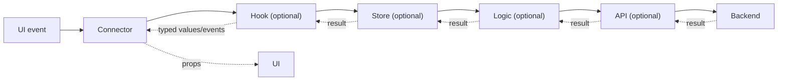
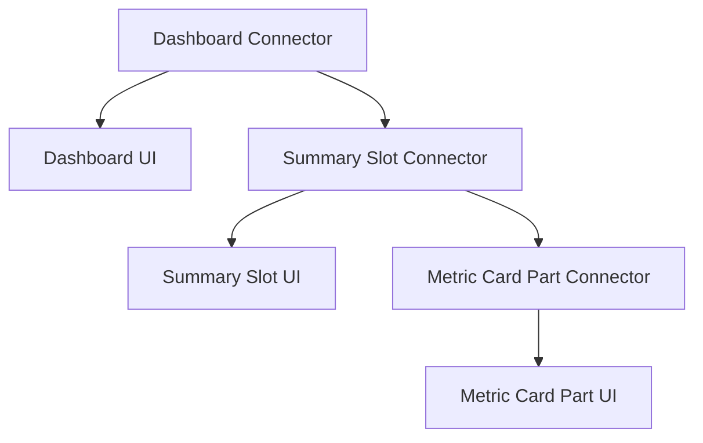
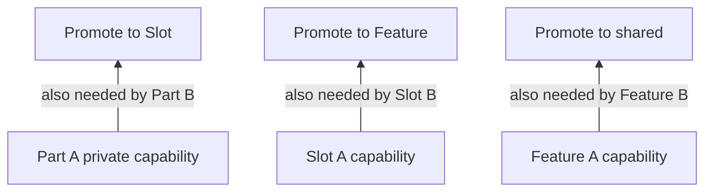

# Srijika Feature → Slot → Part Architecture

Srijika uses one progressive behavior chain at every ownership level:

```text
UI ← Connector → Hook → Store → Logic → API → Backend
```

`UI` and `Connector` are required. `Hook`, `Store`, `Logic`, `API`, and
`Types` are optional capabilities. An owner creates only the capabilities it
needs, but it must never jump over a more senior capability that already exists
for the same behavior.

This contract applies equally to code created in Studio, VS Code, a generated
project, or by Codex through the Srijika plugin.

## Governing rules

1. A matching Connector is the only runtime caller of a UI.
2. A Connector calls the highest available behavior capability in its owner.
3. Every capability calls the next available capability below it.
4. An existing intermediate capability may not be skipped.
5. Results return through the same chain and become typed UI props.
6. Private code moves to a common owner instead of being imported sideways.
7. Empty pass-through capabilities are not generated merely to complete the
   diagram.

The complete command and result path is:



## Canonical Dashboard structure

Every Feature, Slot, and Part repeats the same file contract. A created Slot or
Part immediately receives its required UI and Connector; optional capability
files are added only when selected or recommended.

### Strict ownership-aware creation

Studio folder `+`, Studio folder right-click, the VS Code Explorer command, and
Codex all use one creation matrix:

```text
src/features -> New Feature
Feature root  -> Connector | Hook | Store | Logic | API | Types | New Slot
Slot root     -> Connector | Hook | Store | Logic | API | Types | New Part
Part root     -> Connector | Hook | Store | Logic | API | Types
```

A new Feature, Slot, or Part is a composite scaffold. The entered normalized
PascalCase name derives its kebab-case folder and every related file name. UI
and Connector are required; Hook, Store, Logic, API, and Types are selectable.
All target paths are checked before writing, existing files are never
overwritten, and noncanonical folders or alternate file names are rejected.

```text
src/
├─ features/
│  └─ dashboard/
│     ├─ Dashboard.ui.tsx                    required
│     ├─ Dashboard.connector.tsx             required
│     ├─ useDashboard.ts                     optional Hook
│     ├─ dashboard.store.ts                  optional Store
│     ├─ dashboard.logic.ts                  optional Logic
│     ├─ dashboard.api.ts                    optional API
│     ├─ dashboard.types.ts                  optional shared owner types
│     └─ slots/
│        ├─ summary/
│        │  ├─ Summary.ui.tsx                required
│        │  ├─ Summary.connector.tsx         required
│        │  ├─ useSummary.ts                 optional Hook
│        │  ├─ summary.store.ts              optional Store
│        │  ├─ summary.logic.ts              optional Logic
│        │  ├─ summary.api.ts                optional API
│        │  ├─ summary.types.ts              optional owner types
│        │  └─ parts/
│        │     ├─ metric-card/
│        │     │  ├─ MetricCard.ui.tsx       required
│        │     │  ├─ MetricCard.connector.tsx required
│        │     │  ├─ useMetricCard.ts        optional Hook
│        │     │  ├─ metricCard.store.ts     optional Store
│        │     │  ├─ metricCard.logic.ts     optional Logic
│        │     │  ├─ metricCard.api.ts       optional API
│        │     │  └─ metricCard.types.ts     optional owner types
│        │     └─ progress-chart/
│        │        ├─ ProgressChart.ui.tsx
│        │        └─ ProgressChart.connector.tsx
│        └─ recent-orders/
│           ├─ RecentOrders.ui.tsx
│           ├─ RecentOrders.connector.tsx
│           ├─ useRecentOrders.ts
│           ├─ recentOrders.store.ts
│           ├─ recentOrders.logic.ts
│           ├─ recentOrders.api.ts
│           ├─ recentOrders.types.ts
│           └─ parts/
│              └─ order-row/
│                 ├─ OrderRow.ui.tsx
│                 └─ OrderRow.connector.tsx
└─ shared/                                  cross-feature capabilities only
```

## Capability responsibilities

| Capability | Responsibility                                                                                       | May know                                                  |
| ---------- | ---------------------------------------------------------------------------------------------------- | --------------------------------------------------------- |
| UI         | Typed visual JSX, data props, event props, and `ReactNode` composition slots                         | UI-safe types and components                              |
| Connector  | The owner's public runtime gateway; maps capability output to UI props and composes child Connectors | Matching UI and the highest available behavior capability |
| Hook       | React lifecycle, TanStack Query, effects, subscriptions, cache, retry, and mutations                 | The next available Store, Logic, or API                   |
| Store      | Shared client state, selectors, synchronous transitions, and owner actions                           | The next available Logic or API                           |
| Logic      | Business rules, validation, authorization decisions, transformations, and operation orchestration    | The matching API and pure types/utilities                 |
| API        | URL, HTTP method, headers, request/response parsing, and transport errors                            | Shared HTTP client and API types                          |
| Types      | Contracts shared by two or more files in the same owner                                              | Other type-only modules                                   |

`Types` is not a runtime step. It can be imported type-only wherever its owner
is visible.

## Highest-available resolution

The runtime resolver is deterministic:

```text
Connector: Hook, otherwise Store, otherwise Logic, otherwise API
Hook:      Store, otherwise Logic, otherwise API
Store:     Logic, otherwise API
Logic:     API
API:       shared HTTP client / Backend
```

Therefore all of these configurations are valid:

```text
Connector
Connector → API
Connector → Logic → API
Connector → Store → Logic → API
Connector → Hook → Store → Logic → API
Connector → Hook → Logic → API
Connector → Hook → API
Connector → Store → API
```

If `Hook` exists, the Connector may not import Store, Logic, or API for that
behavior. If `Store` exists below Hook, Hook may not jump to Logic or API. If
`Logic` exists below Store, Store may not jump to API.

### Behavior-level resolution

Seniority is checked per owner and public behavior, not merely by filename. A
capability must expose the behavior before it becomes that behavior's gateway.
The validator must not silently treat a direct lower-layer import as a valid
fallback when a senior file exists. It should recommend adding the behavior to
the senior capability, or explicitly declaring that behavior as not owned by
it.

Example:

```text
loadDashboard:    Connector → Hook → Store → Logic → API
selectLocalTab:   Connector → Hook → Store
formatStaticDate: Connector → Logic
```

This keeps one clear path without forcing unrelated work through meaningless
pass-through functions.

## Feature, Slot, and Part composition

The behavior chain is private to each owner. Composition crosses an ownership
boundary only through Connectors and typed props.



A Feature Connector composes Slot Connectors into its UI's named `ReactNode`
slots. A Slot Connector composes Part Connectors in the same way. A parent must
not render a child's `.ui.tsx` directly or import the child's private Hook,
Store, Logic, or API.

## Ownership and promotion

Each capability belongs to the narrowest owner that needs it:

```text
one Part needs it       → Part root
two Parts need it       → their Slot root
two Slots need it       → their Feature root
two Features need it    → src/shared
```



Allowed visibility flows from an ancestor owner to its descendants. Private
child code never flows upward, sideways to a sibling, or into another Feature.

```text
ancestor public capability  ──✓──> descendant
private child capability    ──✗──> parent or sibling
feature-private capability  ──✗──> another feature
```

## Cache and state guidance

### Hook owns server lifecycle

Use the Hook for TanStack Query and other React lifecycle behavior:

- server cache, stale time, deduplication, and invalidation;
- loading, failure, retry, refresh, pagination, and mutation lifecycle;
- subscriptions, polling, cancellation, and React effects.

### Store owns client state

Use the Store for state shared inside its owner subtree:

- selected tab, open panels, filters, drafts, and wizard progress;
- selectors and synchronous state transitions;
- actions that continue to the next available Logic or API capability.

When no Hook exists, a Store may execute an owner action and retain its current
result. It is not a server cache. Once the behavior requires staleness,
deduplication, retry, background refresh, or mutation invalidation, add a Hook
and keep server state in TanStack Query. Do not mirror the same server entity in
both Query cache and Zustand.

## Enforcement levels

### Errors

These are deterministic architecture violations and must block validation:

- a UI imports or calls Hook, Store, Logic, or API;
- a UI is rendered by anything except its matching Connector;
- a required UI or Connector is missing;
- a runtime layer skips an available intermediate layer for the same behavior;
- Logic contains React, Query, Store, or JSX concerns;
- API contains business decisions or imports a senior runtime layer;
- a parent or sibling imports private child code;
- Feature-private code is imported by another Feature;
- a parent composes a child UI instead of the child Connector.

### Intelligent recommendations

Recommendations are deterministic and non-blocking in the first architecture
release. They explain why a capability should be introduced and offer a safe
refactor path.

| Recommendation       | Trigger signals                                                                                                                                                                      |
| -------------------- | ------------------------------------------------------------------------------------------------------------------------------------------------------------------------------------ |
| Add Logic            | Direct API use contains two or more endpoint calls, business branching, validation, authorization, payload transformation, aggregation, or multi-step orchestration                  |
| Add Hook             | Connector/Store behavior needs cache, retry, polling, cancellation, subscription, pagination, mutation lifecycle, two or more async handlers, or three or more React lifecycle hooks |
| Add Store            | State is consumed by two or more descendants, props cross two ownership boundaries, or an owner Connector contains four or more related local state fields                           |
| Add Hook above Store | A Connector consumes five or more Store selectors/actions, or Store actions accumulate async lifecycle/cache responsibilities                                                        |
| Promote owner        | The same private capability is imported or duplicated by two sibling Parts, two sibling Slots, or two Features                                                                       |
| Split owner          | A UI exceeds 200 meaningful exported-function lines, a `.ui.tsx` exceeds 300 meaningful lines, or its public contract exceeds 16 top-level members                                   |

These are the stable deterministic v1 recommendation IDs:

```text
SRIJIKA-ARCH-RECOMMEND-LOGIC
SRIJIKA-ARCH-RECOMMEND-HOOK
SRIJIKA-ARCH-RECOMMEND-STORE
SRIJIKA-ARCH-RECOMMEND-HOOK-ABOVE-STORE
SRIJIKA-ARCH-RECOMMEND-PROMOTE-OWNER
SRIJIKA-ARCH-RECOMMEND-SPLIT-OWNER
```

A single transport-only request may remain `Connector → API`. A small pure
business operation may remain `Connector → Logic → API`. When two or more Hook
signals are present, Srijika should elevate the guidance from an informational
suggestion to a warning. Structural no-jump and ownership rules remain errors
regardless of complexity.

Example recommendation:

```text
SRIJIKA-ARCH-RECOMMEND-HOOK

Dashboard Connector owns 3 async handlers and 4 request lifecycle fields.
Recommended path:
DashboardConnector → useDashboard → dashboard.store → dashboard.logic → dashboard.api
```

Example error:

```text
SRIJIKA-ARCH-LAYER-JUMP

DashboardConnector imports dashboard.api.ts, but useDashboard.ts is the
highest available owner capability for loadDashboard.

Required path:
DashboardConnector → useDashboard → dashboard.store → dashboard.logic → dashboard.api
```

## Naming

- owner component names use `PascalCase`;
- folders use stable `kebab-case`;
- UI files end in `.ui.tsx`;
- Connector files end in `.connector.tsx`;
- Hooks begin with `use` and end in `.ts` or `.tsx`;
- Stores end in `.store.ts`;
- Logic files end in `.logic.ts`;
- API files end in `.api.ts`;
- owner contracts end in `.types.ts`.

The canonical owner Hook is the flat public file `useOwner.ts`. Additional
helper Hooks may live privately under `hooks/`, but a Connector still enters
through the flat owner Hook when it exists for that behavior.

## Shared contract consumers

This document is the human-readable source for one shared architecture
contract consumed by:

1. Srijika Studio structure creation, Problems, and recommendations;
2. Srijika Language Support in VS Code;
3. generated-project validation and build commands;
4. the Srijika portal documentation;
5. the Codex skill and the MCP resource
   `srijika://docs/code-first-architecture`.

Every consumer must preserve the same capability order, ownership promotion,
error rules, and recommendation meanings.
