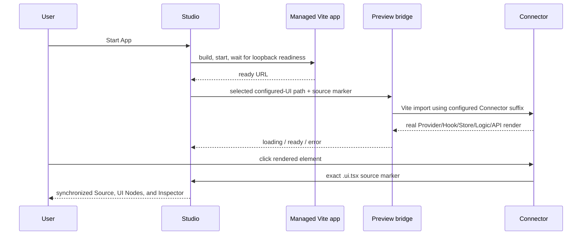

# Live Runtime Preview

## Product rule

An attached desktop project never shows a derived UI in the center as though
the application were running.

```text
App stopped  → Start App
App starting → real build/readiness state
App running  → selected UI's required Connector in the managed Vite runtime
App failed   → actual process or Connector error + retry
```

The bundled `UiDocument` renderer remains available only for browser demos,
detached `.ui.tsx` sources, compiler inspection, and authoring tools outside the
desktop center surface.

## Selection flow



Studio starts one project process. Changing UI Sources does not restart Vite.
The development bridge converts the validated configured UI path into a
same-project Vite module URL, so Vite owns module transforms, dependency
resolution, React Fast Refresh, and HMR.

## Connector resolution

For an indexed source such as:

```text
src/features/dashboard/Dashboard.ui.tsx
```

the running bridge resolves:

```text
src/features/dashboard/Dashboard.connector.tsx
```

and expects `DashboardConnector`, with a single Connector/default export as a
compatibility fallback. A missing or invalid Connector is shown as a real live
runtime error and reported to Studio; the derived renderer is not substituted.

Those names are canonical defaults, not hardcoded preview rules. The bridge
reads `srijika.config.json`, requires its normalized `entry`, and uses resolved
`featuresRoot`, `sharedRoot`, `uiSuffix`, and `connectorSuffix`. For example,
selecting `application/modules/home/Home.view.tsx` in a project configured with
`.view.tsx` and `.gateway.tsx` imports
`application/modules/home/Home.gateway.tsx`. The configured entry is the initial
Studio source and remains a valid live-preview selection even when it is outside
the default `src/features` spelling.

If the project exposes `AppProviders`, the selected Connector is wrapped with
it. This keeps QueryClient and other project providers active. The Connector
then follows the enforced progressive architecture:

```text
Connector → Hook → Store → Logic → API
```

## Runtime protocol

All messages are versioned and accepted only from the embedded managed
loopback frame.

| Message                           | Direction    | Purpose                                      |
| --------------------------------- | ------------ | -------------------------------------------- |
| `srijika:preview-selected-source` | Studio → app | switch Connector and highlight source marker |
| `srijika:preview-runtime-state`   | app → Studio | report loading, ready, or error              |
| `srijika:preview-select`          | app → Studio | select exact live element source             |
| `srijika:preview-hit-test`        | Studio → app | find a live component drop target            |
| `srijika:preview-drop-target`     | app → Studio | return the validated target marker           |

The bridge is active only under `import.meta.env.DEV` and only when the app is
embedded (`window.parent !== window`). Opening the app normally in the system
browser renders the application's regular entry experience.

## Existing projects

New projects contain the current generated bridge. Immediately before the
required start-time build, native Studio atomically upgrades only a recognizable
older Srijika-generated `src/srijika/preview-bridge.ts`. Missing, symlinked, or
custom application-owned files are never overwritten. The upgraded bridge is
config-driven, so valid entry or suffix changes do not require regenerating the
project.

If a project does not acknowledge the runtime protocol within five seconds,
Studio labels the bridge unavailable instead of claiming that source switching
worked.

## Verified native flow — 2026-08-13

- Project opened with only **Start App** in the center.
- Start App launched one managed Vite runtime.
- `Home.ui.tsx`, `D.ui.tsx`, and `NativeAuditFeature.ui.tsx` each switched the
  center to their matching real Connector.
- Clicking the NativeAuditFeature Run button executed Hook → Store → Logic →
  API and changed the live label from Run to Ready.
- Clicking the live button selected the exact TSX range, UI Node, and Inspector
  node in Studio.
- One orphaned dev process left by a prior hot-reloaded desktop instance was
  identified by exact project path/port and stopped; the current managed app
  remained running.

Native screenshots were captured during this verification session and kept as
local audit evidence; machine-specific temporary paths are intentionally not
part of the repository contract.
