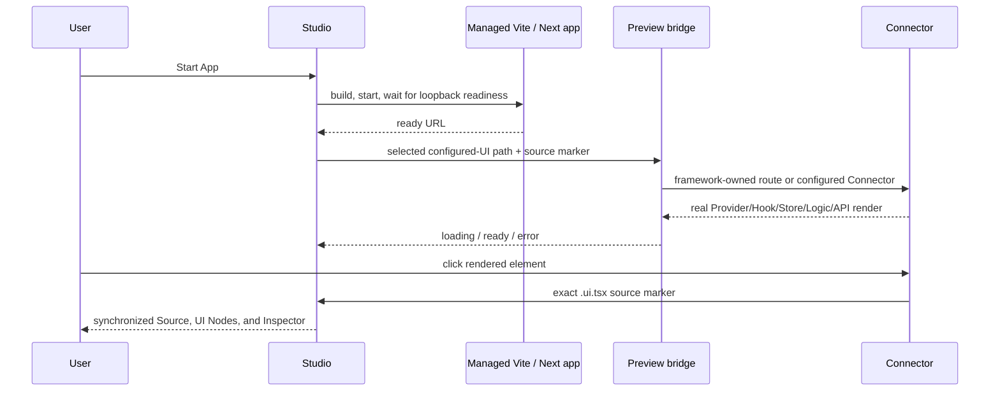

# Live Runtime Preview

## Product rule

An attached desktop project never shows a derived UI in the center as though
the application were running.

```text
App stopped  → Start App
App starting → real build/readiness state
App running  → real route/Connector in the managed Vite or Next.js runtime
App failed   → actual process or Connector error + retry
```

The bundled `UiDocument` renderer remains available only for browser demos,
detached `.ui.tsx` sources, compiler inspection, and authoring tools outside the
desktop center surface.

## Selection flow



Studio starts one project process. Changing UI Sources or Next routes does not restart the framework runtime.
The development bridge converts the validated configured UI path into a
same-project Vite module URL, so Vite owns module transforms, dependency
resolution, React Fast Refresh, and HMR.

For Next.js App Router projects, Studio discovers bounded `app` or `src/app`
`page` files from the existing safe project index. Route groups are shown but
do not become URL segments. Dynamic, catch-all, and optional catch-all segments
require explicit preview values; values cannot introduce traversal, a query,
fragment, host, or another origin. The selected route is appended only to the
native-tracked `http://127.0.0.1:<port>` URL. Inherited `loading.tsx` and
`error.tsx` states are displayed beside each route so the developer knows which
App Router boundaries own failures and transitions.

The Next development adapter uses `instrumentation-client.ts` plus a
development-only TypeScript loader. It annotates governed UI JSX with source
locations during `next dev`, synchronizes clicks and highlights through the
same versioned protocol, and reports when the selected UI is not rendered by
the current route. The loader returns source unchanged for `next build`; source
markers are therefore absent from production compilation. Normal Next routes,
Server Components, `Link`, `Image`, providers, CSS, public assets, client
Connectors, Fast Refresh, and data loading remain owned by Next rather than a
derived renderer.

## Connector resolution

For an indexed source such as:

```text
src/features/dashboard/Dashboard.ui.tsx
```

the running bridge resolves:

```text
src/features/dashboard/Dashboard.connector.tsx
```

and expects `DashboardConnector`, with a single Connector/default export as a
compatibility fallback. A missing or invalid Connector is shown as a real live
runtime error and reported to Studio; the derived renderer is not substituted.

Those names are canonical defaults, not hardcoded preview rules. The bridge
reads `srijika.config.json`, requires its normalized `entry`, and uses resolved
`featuresRoot`, `sharedRoot`, `uiSuffix`, and `connectorSuffix`. For example,
selecting `application/modules/home/Home.view.tsx` in a project configured with
`.view.tsx` and `.gateway.tsx` imports
`application/modules/home/Home.gateway.tsx`. The configured entry is the initial
Studio source and remains a valid live-preview selection even when it is outside
the default `src/features` spelling.

If the project exposes `AppProviders`, the selected Connector is wrapped with
it. This keeps QueryClient and other project providers active. The Connector
then follows the enforced progressive architecture:

```text
Connector → Hook → Store → Logic → API
```

## Runtime protocol

All messages are versioned and accepted only from the embedded managed
loopback frame.

| Message                           | Direction    | Purpose                                      |
| --------------------------------- | ------------ | -------------------------------------------- |
| `srijika:preview-selected-source` | Studio → app | switch Connector and highlight source marker |
| `srijika:preview-runtime-state`   | app → Studio | report loading, ready, or error              |
| `srijika:preview-select`          | app → Studio | select exact live element source             |
| `srijika:preview-hit-test`        | Studio → app | find a live component drop target            |
| `srijika:preview-drop-target`     | app → Studio | return the validated target marker           |

The bridge is active only under `import.meta.env.DEV` and only when the app is
embedded (`window.parent !== window`). Opening the app normally in the system
browser renders the application's regular entry experience.

## Existing projects

New projects contain the current generated bridge. Immediately before the
required start-time build, native Studio atomically upgrades only a recognizable
older Srijika-generated `src/srijika/preview-bridge.ts`. Missing, symlinked, or
custom application-owned files are never overwritten. The upgraded bridge is
config-driven, so valid entry or suffix changes do not require regenerating the
project.

If a project does not acknowledge the runtime protocol within five seconds,
Studio labels the bridge unavailable instead of claiming that source switching
worked.

If dependency installation, production build, or dev startup fails, Studio
keeps the last valid derived UI visible with a failure banner. It never labels
that fallback as the live application. Missing database, authentication, CMS,
or environment dependencies remain real route errors; Studio does not replace
them with invented data.

## Toolchain and process ownership

Managed runtime discovery accepts npm, pnpm, Yarn, and Bun only. The nearest
matching lockfile is authoritative. A project-local lockfile runs installation
in the project; a root-lockfile monorepo runs installation at that root and the
declared `dev`/`build` scripts in the selected project. A mismatched or
ambiguous lockfile fails closed. Install commands are immutable (`npm ci`,
`pnpm install --frozen-lockfile`, `yarn install --immutable`, or
`bun install --frozen-lockfile`).

Vite receives `--host 127.0.0.1 --port <reserved> --strictPort`; Next receives
`--hostname 127.0.0.1 --port <reserved>`. Studio reserves the port before
spawn, tracks the exact child process tree, waits for HTTP readiness, caps
output, and resolves browser/preview URLs only from that record. Windows uses
the package-manager executable shim and hidden process groups; macOS and Linux
use direct argv process groups. WSL is treated as Linux, so project and
lockfile paths must be visible inside the same distribution. Stop, project
switch, and application shutdown terminate the tracked process tree on every
platform.

## Verified native flow — 2026-08-13

- Project opened with only **Start App** in the center.
- Start App launched one managed Vite runtime.
- `Home.ui.tsx`, `D.ui.tsx`, and `NativeAuditFeature.ui.tsx` each switched the
  center to their matching real Connector.
- Clicking the NativeAuditFeature Run button executed Hook → Store → Logic →
  API and changed the live label from Run to Ready.
- Clicking the live button selected the exact TSX range, UI Node, and Inspector
  node in Studio.
- One orphaned dev process left by a prior hot-reloaded desktop instance was
  identified by exact project path/port and stopped; the current managed app
  remained running.

Native screenshots were captured during this verification session and kept as
local audit evidence; machine-specific temporary paths are intentionally not
part of the repository contract.
