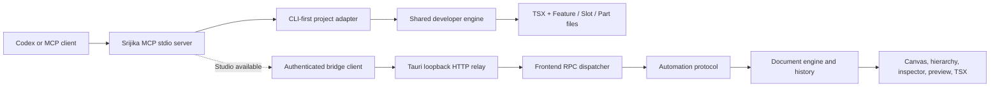

# Srijika Studio Codex plugin architecture

## Purpose

The MCP server has two independent adapters. Code-project tools let Codex inspect,
validate, plan, and safely scaffold the canonical TSX project without Desktop
Studio. When Studio is running, bridge tools additionally expose its canonical
`UiDocument`, canvas, hierarchy, inspector, renderer, and history. Neither adapter
maintains a second editable source tree.



Generated projects include `.mcp.json`, `.vscode/mcp.json`, and `AGENTS.md`.
`npx -y @srijika/mcp-server@0.2.0 --project .` bounds all code-project tools to
that project. The read tools publish metadata, canonical files, and diagnostics;
the plan/apply pair uses the same atomic no-overwrite scaffold service as CLI and
VS Code. A missing Studio descriptor affects only visual document/preview tools.

## Layers

| Layer               | Source                                | Responsibility                                                                      |
| ------------------- | ------------------------------------- | ----------------------------------------------------------------------------------- |
| Plugin package      | `plugins/srijika-studio`              | Install metadata, skill, launcher, MCP bundle, protocol manifest                    |
| MCP server          | `packages/mcp-server`                 | Focused tools/resources, schemas, structured errors, bridge discovery               |
| Automation protocol | `packages/automation-protocol`        | Version constants, read models, high-level operations, atomic executor, adapters    |
| Tauri relay         | `crates/studio-bridge`                | Per-process auth, bounded loopback HTTP, frontend event relay                       |
| Desktop integration | `apps/studio/src-tauri`               | Descriptor lifecycle and Tauri commands/events                                      |
| Frontend dispatcher | `apps/studio/src/lib/codex-bridge.ts` | Route RPC methods to the active Studio store and commit one validated history entry |

## Write transaction

1. Codex reads the current page revision.
2. The MCP server validates the tool payload.
3. The bridge authenticates the request and relays it to the editor.
4. `applyOperations` executes against a private working document.
5. Canonical schema, graph, registry, and semantic validation run.
6. On success, Studio commits the final document once and returns generated IDs plus the new revision.
7. On any failure, Studio keeps the original document unchanged.

This makes a batch one undoable history entry and prevents stale agents from overwriting newer user work.

## Code-first architecture guidance

The MCP server exposes `srijika://docs/code-first-architecture` as a compact,
read-only JSON contract. It gives Codex the same Feature → Slot → Part rules as
Studio, VS Code, and generated-project validation:

```text
UI ← Connector → Hook → Store → Logic → API
```

UI and Connector are required for every Feature, Slot, Part, and Shared Widget.
The remaining capabilities are optional, but an existing intermediate
capability cannot be skipped for the same behavior. Shared UI and Shared
Headless Capability use their stricter exceptions below. The resource also
publishes the deterministic v1 recommendation IDs and thresholds, cache/state
ownership, child-Connector composition, and Part → Slot → Feature → resolved
`{sharedRoot}` (`src/shared` by default) promotion rules. This is a documentation resource only; it does
not change the bridge protocol or document format.

The resource makes two source boundaries explicit rather than leaving them to
agent interpretation:

```text
SRIJIKA4101  SRIJIKA-ARCH-UI-RUNTIME-IMPORT
SRIJIKA4116  SRIJIKA-ARCH-DIRECT-CHILD-UI
SRIJIKA4117  SRIJIKA-ARCH-PASSIVE-TYPES
SRIJIKA4118  SRIJIKA-ARCH-LOGIC-RUNTIME-CONCERN
SRIJIKA4119  SRIJIKA-ARCH-UNPROVABLE-DYNAMIC-IMPORT
SRIJIKA4120  SRIJIKA-ARCH-UNRESOLVED-PROJECT-ALIAS
SRIJIKA4121  SRIJIKA-ARCH-UNRESOLVED-PROJECT-IMPORT
```

Only the matching Connector renders an owner UI. A parent or sibling composes
the child Connector; only a pure UI may directly compose a canonical Shared UI
Primitive. UI cannot call identifier/property Hooks (`useHome()`,
`React.useState()`), use browser/runtime APIs (`fetch`, `XMLHttpRequest`,
`WebSocket`, `localStorage`, `sessionStorage`), or import runtime layers. Types
files are passive interfaces/type aliases consumed through `import type` and
`export type`; they cannot declare, export, or reference runtime values.
Every UI also blocks external runtime behavior modules and callable utilities;
external imports are limited to types, styles/assets, safe React JSX support,
and presentational bindings used exclusively as JSX tags.

Logic remains framework-free and deterministic. Pure validation,
authorization, transforms, aggregation, and orchestration through the matching
API remain valid, while React/Hook, React Query/query-cache, router, and
client-state lifecycle concerns fail with `SRIJIKA4118`. The resource routes
those concerns to Hook, Connector, or Store and request transport to API.

Computed `import()` and `require()` targets inside governed ownership roots fail
with `SRIJIKA4119`; only static string or no-substitution template targets are
provable. A declared or reserved project alias that does not resolve to a
scanned governed source fails with `SRIJIKA4120`.
Any relative or `src/...` source import made by a governed file must resolve
inside the scanned configured Feature/Shared roots or fail with `SRIJIKA4121`.
CSS and static assets are exempt; external dependencies use bare npm specifiers.

The resolved `{sharedRoot}` (`src/shared` by default) is a strict ownership
root, not agent scratch space. The resource defines exactly three composite
kinds:

| Shared kind                | Required                  | Optional                       | Forbidden                        |
| -------------------------- | ------------------------- | ------------------------------ | -------------------------------- |
| Shared UI Primitive        | pure UI                   | Types                          | Connector and every runtime file |
| Shared Widget              | UI + Connector            | Hook, Store, Logic, API, Types | arbitrary folders/files          |
| Shared Headless Capability | one runtime layer minimum | Hook, Store, Logic, API, Types | UI and Connector                 |

Agents create them with the public structure kinds `shared-ui`,
`shared-widget`, and `shared-capability`. A primitive receives everything by
typed props/events. A widget is consumed through its Connector. A headless
capability is consumed through its highest available Hook, Store, Logic, or API
boundary. Shared code never imports a Feature, Feature consumers never reach a
private shared file, and no client may invent `utils`, `common`, barrels, or
deeper shared nesting. Owner folders use their exact derived kebab-case names,
and runtime dependencies between Shared owners must remain acyclic; type-only
edges do not form runtime cycles.

Hook and Store gateways start flat. The MCP plan/apply tools accept
`behavior-hook <Behavior>` and `store-slice <Concern>` structure requests. The
shared writer derives owner-prefixed names, atomically moves the gateway into
the resolved `{hooksDirectory}/` or `{storesDirectory}/` (`hooks/` and
`stores/` by default), rewires imports across the complete bounded project
source tree, and removes the root file. TS/JS family sources are considered;
declarations, vendor/build directories, and nested Srijika projects are not.
Unsafe entries, symlinks, incomplete scans, stale source, or byte-limit failures
abort before the first write. The MCP resource marks mixed layouts, alternate
names, `index.ts`, private imports, and deeper capability folders as hard errors
rather than agent discretion.

The resource also publishes the validated `srijika.config.json` architecture
surface. Custom Feature/Shared roots are bounded project-relative and
non-overlapping; slot/part/hook/store directory names are distinct single
segments; canonical suffixes are case-insensitively distinct, non-overlapping
basename-only `.tsx`/`.ts` values.
Traversal, absolute paths, backslashes, overlapping roots, and filesystem
symlink escapes are rejected before an adapter discovers, reads, plans, or
writes project files.

The complete project contract requires `"sourceOfTruth": "tsx"` and a
normalized project-relative `entry` ending in the resolved `uiSuffix`. The
optional architecture block has exact profile `feature-slot-part-v1` plus all
twelve supported override fields: `featuresRoot`, `sharedRoot`,
`slotsDirectory`, `partsDirectory`, `hooksDirectory`, `storesDirectory`,
`uiSuffix`, `connectorSuffix`, `storeSuffix`, `logicSuffix`, `apiSuffix`, and
`typesSuffix`. Omitted override fields use canonical defaults.

An absent `architecture` block means canonical defaults. Once the block exists,
the exact `feature-slot-part-v1` profile is mandatory; missing or unsupported
profiles fail closed on generated validation, CLI, VS Code, Studio, and MCP.
The generated validator reloads current project configuration on every run.
`check --watch` uses a filtered project-root watcher for config, root
`tsconfig.json`, entry, resolved roots, and future-root ancestors and recovers
after temporarily invalid config. VS Code/Studio exact-file and safe-move
previews use the canonical planner instead of reconstructing hardcoded paths.

The root TypeScript configuration is parsed as JSONC. `extends` is rejected;
`references` may be absent or empty but cannot be nonempty; and
`compilerOptions.baseUrl` must be omitted. Srijika accepts only exact and
slash-delimited terminal `/*` `compilerOptions.paths` mappings, takes the first
target, and requires it to remain within the project.
Generated `@/`, `@features/`, and `@shared/` mappings are understood. Reserved
local-looking `~/`, `#...`, `@app`, and `@src` imports fail closed when they do
not resolve. Vite-only aliases are unsupported unless the same mapping is
declared in `tsconfig.json`; ordinary npm package specifiers remain external.

The configured UI `entry` is authoritative even outside the configured roots:
it is included in the complete source budget and receives the strict UI and
`SRIJIKA4119`–`SRIJIKA4121` checks. All project readers reject symlinked roots, metadata, sources, and path
ancestors. Config reads are capped at 64 KiB and `tsconfig.json` at 1 MiB. The
architecture and migration corpus is capped at 4,096 source files, 32,768
entries, 4,096 directories, depth 32, 4 MiB per source, and 24 MiB total; an
incomplete corpus fails rather than returning a partial validation or rewire.

Studio's managed Vite bridge reads the same config at runtime: it opens the
configured `entry`, discovers the configured `uiSuffix`, and imports the
matching configured `connectorSuffix`. Legacy generated bridges are upgraded
only when recognizable; application-owned custom bridges are preserved.

`SRIJIKA-ARCH-RECOMMEND-PROMOTE-OWNER` is emitted with
`owner-consumers=2` evidence on the blocking private-ownership diagnostic and
points at the nearest common Part → Slot → Feature → Shared owner.
`SRIJIKA-ARCH-RECOMMEND-SPLIT-OWNER` is emitted as non-blocking `SRIJIKA4202`
only above the exact 200/300/16 UI guardrails (201/301/17).

The companion `srijika://docs/cli-runtime` resource publishes the shared
developer-workflow contract. Codex should prefer `srijika create`, `init`, `add`, `check`,
`doctor`, `dev`, `build`, and `studio` instead of reconstructing package-manager
or runtime decisions. Node is the compatibility default; Bun is explicit,
Vite-only, and never changes dependency resolution.

The starter is minimal by default and does not install TanStack Query or emit a
Query Provider. `srijika create <directory> --react-query` is the explicit
opt-in when server cache, retry, invalidation, or mutation lifecycle is needed.
This is independent of Node versus Bun selection.

## Authentication and local security

- Studio binds only `127.0.0.1` on an OS-selected ephemeral port.
- Every Studio process creates a fresh 256-bit bearer token.
- The endpoint/token descriptor is atomically stored in the current user's application-data directory. Unix permissions are `0600`; Windows relies on the per-user LocalAppData ACL.
- Every HTTP route requires constant-time bearer verification, including health.
- The client rejects non-loopback descriptor endpoints and checks instance ID/PID health before RPC.
- Header, body, concurrency, and response time limits bound resource use.
- Health, status, diagnostics, and MCP results never include the token.

## Image-to-UI path

Codex uses its existing image understanding to inspect a screenshot. It queries the compact component catalog, decomposes the layout, and calls `srijika_import_design_plan` with versioned JSON operations. The bridge does not upload the image and does not require a separate vision API key.

The first release reports render-ready preview metadata and focuses the requested Studio viewport. Pixel comparison uses an available Codex browser/screenshot capability. Native webview bitmap capture can be added later behind a capability flag without changing operation semantics.

## Independent versions

| Version            | Initial value | Change when                                                   |
| ------------------ | ------------- | ------------------------------------------------------------- |
| Plugin             | `0.1.0`       | Packaging, skill, launcher, or bundled server release changes |
| Tool               | `0.1.0`       | MCP tool/resource implementation changes                      |
| Bridge protocol    | `1.0`         | Request/response semantics break                              |
| Document format    | `1`           | Persisted canonical AST shape breaks                          |
| Component manifest | Per component | A registered component port contract changes                  |

Compatible changes add optional response fields, new operation kinds, or capability flags. Breaking payload changes require a `ProtocolAdapterRegistry` adapter. Persisted AST changes require a document migration. Deprecated aliases remain visible in capabilities until a declared breaking release.

## Local build and validation

Repository tooling and the standalone plugin bundle require Node.js
`>=22.13.0`. The npm release verification job tests the declared floor and Node
24, while publication remains on Node 24 for Trusted Publishing.

```bash
pnpm install
pnpm --filter @srijika/mcp-server build
pnpm verify
cargo test -p studio-bridge -p srijika-studio
```

Plugin and skill validation use the Codex-bundled creators:

```bash
python3 "$CODEX_HOME/skills/.system/plugin-creator/scripts/validate_plugin.py" plugins/srijika-studio
python3 "$CODEX_HOME/skills/.system/skill-creator/scripts/quick_validate.py" plugins/srijika-studio/skills/srijika-studio
```

The repository marketplace is `.agents/plugins/marketplace.json`. After adding that marketplace to Codex, install `srijika-studio@srijika-studio-local` and restart or reload MCP servers. The checked-in `.mcp.json` invokes the portable `node scripts/run-mcp.mjs` bootstrap so stdio stays byte-for-byte transparent. That bootstrap keeps MCP in Windows for a native Studio descriptor and re-executes the bundled server inside WSL for a WSL descriptor, preserving loopback isolation on both sides. WSL defaults are distribution `Ubuntu` and the Windows username; environment overrides cover different installations. `scripts/run-mcp.cmd` remains the explicit Windows smoke/fallback launcher, while `scripts/run-mcp.sh` is the Unix launcher for future platform-specific packaging.

The installed plugin does not rely on repository workspaces or a neighboring
`node_modules`: its MCP entry point is one self-contained bundle, including the
TypeScript parser. The publishable `@srijika/mcp-server` package remains a
normal package and declares `typescript` as a runtime dependency; this is
intentionally separate from the isolated plugin artifact.

## Evolution checklist

When Studio architecture changes:

1. Change the canonical contracts/document engine first.
2. Add a migration or protocol adapter and contract tests.
3. Update frontend RPC routing and MCP input schemas.
4. Update `CAPABILITIES`, documentation resources, skill references, and `assets/protocol-manifest.json`.
5. Rebuild the bundled MCP file.
6. Run mixed-version rejection, atomic rollback, native bridge, plugin validation, and real MCP handshake tests.
7. Update the plugin cachebuster through the plugin-creator script; do not hand-edit release cache metadata.
