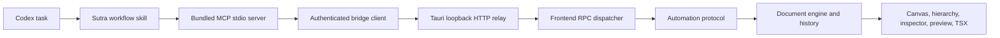

# Sutra Studio Codex plugin architecture

## Purpose

The plugin lets Codex read and change the same canonical `UiDocument` used by the Studio canvas, hierarchy, inspector, renderer, and code generator. It does not automate pointer coordinates and it does not maintain a second editable UI tree.



## Layers

| Layer               | Source                                | Responsibility                                                                      |
| ------------------- | ------------------------------------- | ----------------------------------------------------------------------------------- |
| Plugin package      | `plugins/sutra-studio`                | Install metadata, skill, launcher, MCP bundle, protocol manifest                    |
| MCP server          | `packages/mcp-server`                 | Focused tools/resources, schemas, structured errors, bridge discovery               |
| Automation protocol | `packages/automation-protocol`        | Version constants, read models, high-level operations, atomic executor, adapters    |
| Tauri relay         | `crates/studio-bridge`                | Per-process auth, bounded loopback HTTP, frontend event relay                       |
| Desktop integration | `apps/studio/src-tauri`               | Descriptor lifecycle and Tauri commands/events                                      |
| Frontend dispatcher | `apps/studio/src/lib/codex-bridge.ts` | Route RPC methods to the active Studio store and commit one validated history entry |

## Write transaction

1. Codex reads the current page revision.
2. The MCP server validates the tool payload.
3. The bridge authenticates the request and relays it to the editor.
4. `applyOperations` executes against a private working document.
5. Canonical schema, graph, registry, and semantic validation run.
6. On success, Studio commits the final document once and returns generated IDs plus the new revision.
7. On any failure, Studio keeps the original document unchanged.

This makes a batch one undoable history entry and prevents stale agents from overwriting newer user work.

## Authentication and local security

- Studio binds only `127.0.0.1` on an OS-selected ephemeral port.
- Every Studio process creates a fresh 256-bit bearer token.
- The endpoint/token descriptor is atomically stored in the current user's application-data directory. Unix permissions are `0600`; Windows relies on the per-user LocalAppData ACL.
- Every HTTP route requires constant-time bearer verification, including health.
- The client rejects non-loopback descriptor endpoints and checks instance ID/PID health before RPC.
- Header, body, concurrency, and response time limits bound resource use.
- Health, status, diagnostics, and MCP results never include the token.

## Image-to-UI path

Codex uses its existing image understanding to inspect a screenshot. It queries the compact component catalog, decomposes the layout, and calls `sutra_import_design_plan` with versioned JSON operations. The bridge does not upload the image and does not require a separate vision API key.

The first release reports render-ready preview metadata and focuses the requested Studio viewport. Pixel comparison uses an available Codex browser/screenshot capability. Native webview bitmap capture can be added later behind a capability flag without changing operation semantics.

## Independent versions

| Version            | Initial value | Change when                                                   |
| ------------------ | ------------- | ------------------------------------------------------------- |
| Plugin             | `0.1.0`       | Packaging, skill, launcher, or bundled server release changes |
| Tool               | `0.1.0`       | MCP tool/resource implementation changes                      |
| Bridge protocol    | `1.0`         | Request/response semantics break                              |
| Document format    | `1`           | Persisted canonical AST shape breaks                          |
| Component manifest | Per component | A registered component port contract changes                  |

Compatible changes add optional response fields, new operation kinds, or capability flags. Breaking payload changes require a `ProtocolAdapterRegistry` adapter. Persisted AST changes require a document migration. Deprecated aliases remain visible in capabilities until a declared breaking release.

## Local build and validation

```bash
pnpm install
pnpm --filter @sutra/mcp-server build
pnpm verify
cargo test -p studio-bridge -p sutra-studio
```

Plugin and skill validation use the Codex-bundled creators:

```bash
python3 "$CODEX_HOME/skills/.system/plugin-creator/scripts/validate_plugin.py" plugins/sutra-studio
python3 "$CODEX_HOME/skills/.system/skill-creator/scripts/quick_validate.py" plugins/sutra-studio/skills/sutra-studio
```

The repository marketplace is `.agents/plugins/marketplace.json`. After adding that marketplace to Codex, install `sutra-studio@sutra-studio-local` and restart or reload MCP servers. The checked-in `.mcp.json` uses the Windows command launcher so stdio stays byte-for-byte transparent. Its Node bootstrap keeps MCP in Windows for a native Studio descriptor and re-executes the bundled server inside WSL for a WSL descriptor, preserving loopback isolation on both sides. WSL defaults are distribution `Ubuntu` and the Windows username; environment overrides cover different installations. `scripts/run-mcp.sh` is the Unix launcher for future platform-specific packaging.

## Evolution checklist

When Studio architecture changes:

1. Change the canonical contracts/document engine first.
2. Add a migration or protocol adapter and contract tests.
3. Update frontend RPC routing and MCP input schemas.
4. Update `CAPABILITIES`, documentation resources, skill references, and `assets/protocol-manifest.json`.
5. Rebuild the bundled MCP file.
6. Run mixed-version rejection, atomic rollback, native bridge, plugin validation, and real MCP handshake tests.
7. Update the plugin cachebuster through the plugin-creator script; do not hand-edit release cache metadata.
